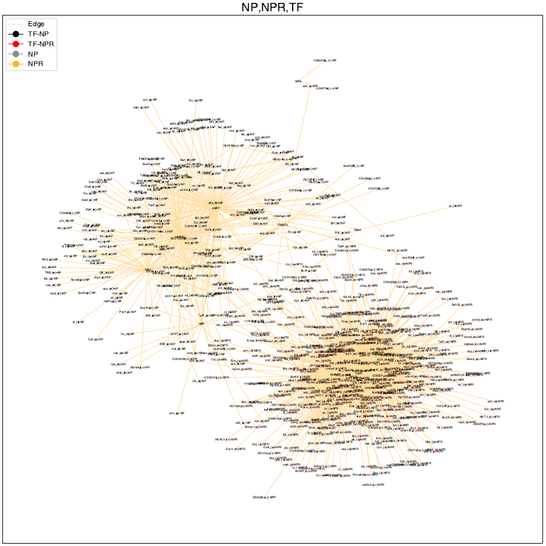
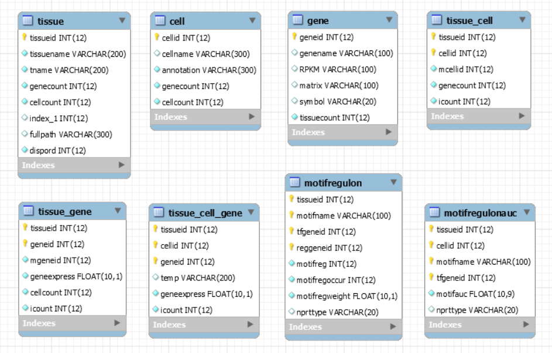

<!---->


# Neuropeptide Receptor Regulation and Adaptation

This repository provides the data and source code used in the paper(https://www.biorxiv.org/content/10.1101/2024.11.23.624967v1).

## Data Curation

The fly cell atlas portal (https://flycellatlas) was utilized, which provides single-cell RNA sequencing (snRNA-seq) data, 
a total of 17 loom files were obtained for tissue snRNA-seq data. 
The missing genetic information could also be constructed from the gene table data obtained 
from the file gene_rpkm_matrix_fb_2021_06.tsv, which was downloaded from FlyBase(https://flybase.org/).


## Data Pre Processing
<p align="center">
  
</p>
Using a Python program, data on tissue, genes, cells, gene expression levels in cells, 
and motif expression levels in cells were stored in a MySQL database via the Python package scanpy. 
In these files, the number of tissues stored is 17, genes are 16,373, cells are 507,827
and TFs are 565. 1,657,811 motif regulon data regulating gene transcription by tissue, 
and 113,532,025 motif regulon data regulating gene transcription by tissue and cell.
Approximately 450 million gene expression records, regulon motif  were stored. 
The pre-built MySQL database contains about 21G of data, allowing for checking 
gene expression across the entire Drosophila, not limited to tissues, using SQL queries.


## Preparing Network Data 
The database is structured with information on Gene, Cell, Tissue, Gene Expression, and Motif TFs that are interconnected. By using an SQL query, we can create data files with the necessary information. The following is a query to organize the data and store it in a single table. Since a large amount of computation is required to link each data set, the table is pre-constructed so that data for graphing can be extracted in real-time.

```shell
insert into prt_10_exp (tname, motifname, tfgenename, tfcount, npgenename, nprgenename, tfauc, 
npmotifregoccur, npmotifregweight, npgexpress, nprmotifregoccur, nprmotifregweight, nprgexpress, nprtype) 
select e.tname ,  np_npr.nprmotifname, b.genename  tfgenename , count(np_npr.tfgeneid) tfcount , 
c.genename  npgenename  , d.genename  nprgenename , np_npr.npauc ,
CAST(avg(f.motifregoccur)AS signed integer)  , avg(f.motifregweight),avg(npgexpress) ,  
CAST(avg(g.motifregoccur)AS signed integer)  , avg(g.motifregweight) , avg(nprgexpress) ,'np_npr' from 
(
select np.tissueid, np.cellid , np.tfgeneid , np.motifname npmotifname , np.geneid npgeneid , np.geneexpress npgexpress, npr.geneexpress nprgexpress,  npr.motifname nprmotifname , npr.geneid nprgeneid , np.motifauc npauc , npr.motifauc nprauc from
(
	select b.tissueid , a.cellid , b.tfgeneid, b.motifname,  d.geneid , e.pid ,  b.motifauc , i.geneexpress
	from 
	(
		select j.cellid from npr_10_cell  j,
		np_10_cell k
		where j.cellid = k.cellid
	) a,
	motifregulonauc b ,
	motifregulon c ,
	nprtgene d ,
    pairprgene e,
	tissue_cell_gene i
	where a.cellid = b.cellid
    and b.tissueid=17
	and a.cellid = i.cellid
	and b.tissueid = c.tissueid
	and c.reggeneid = d.geneid
	and d.geneid = i.geneid
	and c.tfgeneid = b.tfgeneid
	and d.used=1
	and d.genetype='p'
	and b.tissueid= i.tissueid
    and d.geneid= e.geneid
) np ,
(
	select b.tissueid , a.cellid , b.tfgeneid, b.motifname,   d.geneid ,e.pid , b.motifauc , i.geneexpress
	from 
	(
		select j.cellid from npr_10_cell  j,
		np_10_cell k
		where j.cellid = k.cellid
	) a,
	motifregulonauc b ,
	motifregulon c ,
	nprtgene d ,
    pairprgene e,
	tissue_cell_gene i
	where a.cellid = b.cellid
	and a.cellid = i.cellid
    and b.tissueid=17
	and b.tissueid = c.tissueid
	and c.reggeneid = d.geneid
	and d.geneid = i.geneid
	and c.tfgeneid = b.tfgeneid
	and d.used=1
	and d.genetype='r'
	and b.tissueid= i.tissueid
    and d.geneid = e.geneid
    ) npr    
where np.tissueid = npr.tissueid
and np.cellid = npr.cellid
and np.tfgeneid = npr.tfgeneid
and np.pid = npr.pid
) np_npr ,
cell a ,
gene b , 
gene c ,
gene d ,
tissue e ,
motifregulon f ,
motifregulon g
where np_npr.cellid = a.cellid
and f.tissueid=17
and g.tissueid=17
and np_npr.tfgeneid = b.geneid
and np_npr.tfgeneid = f.tfgeneid
and np_npr.npmotifname = f.motifname
and np_npr.nprmotifname = g.motifname
and np_npr.tfgeneid = g.tfgeneid
and np_npr.npgeneid = c.geneid
and np_npr.npgeneid = f.reggeneid
and np_npr.nprgeneid = d.geneid
and np_npr.nprgeneid = g.reggeneid
and np_npr.tissueid = e.tissueid
group by e.tname , e.tname , np_npr.npmotifname, np_npr.nprmotifname , np_npr.tfgeneid , np_npr.npgeneid
order by e.dispord , e.tname , np_npr.npmotifname, np_npr.nprmotifname, np_npr.tfgeneid ,  np_npr.tfgeneid , np_npr.npgeneid
 
```
In the Fly Cell Atlas, TF-related information is organized using the AUCell algorithm, 
providing information on the genes regulated by TFs and the gene expression levels in each cell. 
Therefore, for our experiment, we were able to extract data on the expression levels of NP, NPRs, 
and TFs by linking the relationships within the data without generating new data, using statistical methods.

<div align="center">
```shell
|Tissue|Motif|TF|NP|NPR|NP GeneExpression|NPR GeneExpression|
|Body|acj6_(+)|acj6|sNPF|sNPF-R|5.50833|1.725|
|Body|Atf6_(+)|Atf6|sNPF|sNPF-R|5.50833|1.725|
|Body|CG16779_(+)|CG16779|AstA|AstA-R1|7.04444|4.21481|
|Body|CG16779_(+)|CG16779|sNPF|sNPF-R|5.50833|1.725|
|Body|dimm_(+)|dimm|AstC|AstC-R1|6.12048|1.86747|
|Head|Atac3_(+)|Atac3|sNPF|sNPF-R|3.40309|1.45361|
|Head|bru3_(+)|bru3|AstA|AstA-R1|7.0572|4.3178|
|Head|Cf2_(+)|Cf2|sNPF|sNPF-R|3.39565|1.45351|
|Head|CG16779_(+)|CG16779|AstA|AstA-R1|7.0572|4.3178|
|Head|CG16779_(+)|CG16779|sNPF|sNPF-R|3.39565|1.45351|
|Head|CG44247_(+)|CG44247|FMRFa|FMRFaR|3.33333|1.21569|
```
</div>

## Zekun Wu add saction.(Regulation of aging)

## Visualization of NPs, NPRs, and TFs Network
<p align="center">
  
</p>

10 NPs and 13 NPRs required for the TF network experiment were selected. In the Fly Cell Atlas, 
TF-related information is organized using the AUCell algorithm. We used the relational data between these genes and TFs.
1) To maximize the difference between NP and NPR, cells where NP and NPR are co-expressed were excluded.
2) Cells where TF is co-expressed in cells where NP and NPR are expressed separately were extracted.
3) TF expression data were extracted from cells expressing NP and NPR.
4) Networks were connected where NP and TF were expressed in the same cells.
5) Networks were connected where NPR and TF were expressed in the same cells.
Through network graphs, it was possible to easily visualize the regulatory differences of TFs between NP and NPR. 
The network was implemented using the Python packages matplotlib and networkx. 

